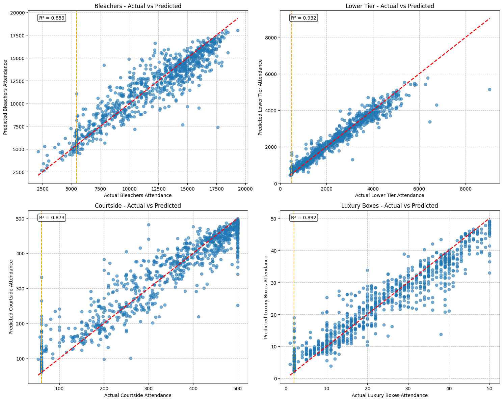

# BuzzerBeater Arena Optimizer

A Python application for collecting, storing, and analyzing BuzzerBeater basketball game data including attendance, pricing, and revenue optimization.

## Quick Start

1. **Clone the Repository**:

   ```bash
   git clone https://github.com/IonMich/bb-arena.git
   cd bb-arena
   ```

2. [Install `uv`](https://docs.astral.sh/uv/getting-started/installation/#standalone-installer)

3. **Configure Environment Variables**:

   ```bash
   cp .env.example .env
   # Edit .env with your BuzzerBeater credentials:
   # BB_USERNAME=your_username
   # BB_SECURITY_CODE=your_security_code
   ```

## Usage

### Frontend (Web Interface)

1. **Start Python Server**:

   ```bash
   uv run run_server.py
   ```

2. **Start Frontend**:

   ```bash
   cd frontend
   npm install
   npm run dev
   ```

3. **Access the Web Interface**:

   Open your browser and go to `http://localhost:5173`.

### Bulk Collection Script

1. **Run Collection Script**:

   ```bash
   uv run python scripts/test_collection.py
   ```

   Add the `--help` flag to see available options.

   <!-- add the image -->
   

## Development Testing

```bash
# Run tests
uv run pytest
```

## Development

```bash
# Type Checking
uv run ty check src/

# Linting
uv run ruff check src/
```
